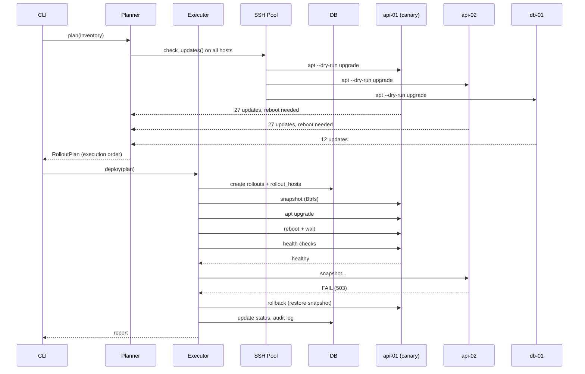

# PatchPilot

**Agentless Linux fleet update orchestration with canary deployments, health checks, and automatic rollback.**

[](https://github.com/piotrgac/patchpilot/actions/workflows/ci.yml)

PatchPilot solves one hard problem: how to safely update packages across dozens of Linux servers without accidentally taking down your environment.

---

## Why PatchPilot?

Existing configuration management tools (Ansible, Salt, Puppet) are **general-purpose**. They can update packages, but they don't specialise in the rollout problem:

- **No canary logic** — all hosts are updated in whatever order the playbook defines.
- **No automatic rollback** — if a package breaks a service, you find out from your monitoring, not from the tool.
- **No health verification** — "package installed" ≠ "service is actually working".
- **No state machine** — if the control machine crashes mid-rollout, you have no idea which hosts were updated.

PatchPilot is designed specifically for this workflow:

```
patchpilot plan production          → dry-run, see what would change
patchpilot deploy production        → canary → batch → health checks
patchpilot status rollout-abc123    → see per-host state
patchpilot rollback rollout-abc123  → restore from snapshot
patchpilot history                  → recent rollout log
patchpilot audit rollout-abc123     → tamper-proof event log
```

---

## Features

- **Agentless** — communicates over SSH. No software to install on target hosts.
- **Canary deployments** — update one host first, verify it's healthy, then proceed.
- **Automatic rollback** — takes Btrfs/LVM/ZFS snapshots before each update, restores on failure.
- **Health checks** — verify systemd services, HTTP endpoints, TCP ports, journal logs, and custom commands after each update.
- **State machine** — each host progresses through defined states. Crashes are recoverable via `--resume`.
- **Idempotent** — snapshots are created once, updates are skipped if not needed, interrupted rollouts can be resumed.
- **Multi-distro** — Ubuntu/Debian (apt), Fedora/RHEL/Rocky (dnf), Arch Linux (pacman).
- **Maintenance windows** — restrict deployments to specific days/times with timezone support.
- **Audit trail** — every operation is logged with optional SHA256 hash chain for tamper detection.
- **Prometheus metrics** — expose rollout results via textfile collector.
- **SQLite** — state is stored in a database, not in memory.
- **CLI filtering** — `--limit`, `--skip-health-checks`, `--force` for operational flexibility.

---

## Quick start

### Prerequisites

- Python 3.11+
- SSH key with passwordless sudo access to target hosts
- Target hosts: Ubuntu, Debian, Rocky, Fedora, or Arch Linux

### Install

```bash
# From source
git clone https://github.com/piotrgac/patchpilot.git
cd patchpilot
pip install -e .

# Or with uv (faster)
uv sync
```

### Configure

```bash
# Generate a stub config
patchpilot config init production

# Or write your own (see examples/)
vim ~/.config/patchpilot/production.yaml
```

### Run

```bash
# 1. See what would change
patchpilot plan production

# 2. Deploy with canary (1 host first, rest in batches of 2)
patchpilot deploy production --strategy canary

# 3. Check status
patchpilot status rollout-abc123

# 4. If something went wrong — rollback
patchpilot rollback rollout-abc123

# 5. View history and audit log
patchpilot history
patchpilot audit rollout-abc123
```

---

## CLI reference

| Command | Description |
|---------|-------------|
| `plan <env>` | Dry-run analysis of updates |
| `deploy <env>` | Execute a rollout |
| `status <id>` | Show rollout status |
| `rollback <id>` | Restore snapshots |
| `history` | Recent rollouts |
| `audit <id>` | Detailed event log |
| `validate [path]` | Validate inventory YAML |
| `config init <env>` | Create config template |
| `config show <env>` | Show current config |

### Deploy options

| Flag | Description |
|------|-------------|
| `--strategy canary/batch/single` | Override rollout strategy |
| `--auto-approve` | Skip confirmation prompt |
| `--dry-run` | Show plan without executing |
| `--limit <glob>` | Only update matching hosts (e.g. `api*`) |
| `--skip-health-checks` | Skip post-update verification |
| `--force` | Override maintenance window checks |
| `--resume <id>` | Resume an interrupted rollout |

---

## Example inventory

```yaml
metadata:
  name: production
  owner: sre@example.com

connection:
  ssh_user: deploy
  ssh_key_path: ~/.ssh/patchpilot_ed25519
  parallel_limit: 5

hosts:
  - name: api-01
    address: 10.10.0.11
    role: api
    tags: [canary-eligible]
  - name: api-02
    address: 10.10.0.12
    role: api
  - name: db-01
    address: 10.10.0.20
    role: database

strategy:
  type: canary
  canary:
    count: 1
    tag_filter: canary-eligible
  batch:
    size: 2

health_checks:
  global:
    - type: systemd
      service: ssh.service
  per_role:
    api:
      - type: http
        url: http://localhost:8080/health
        expected_status: 200
      - type: journal
        service: nginx.service
        forbidden_patterns: ["OutOfMemory"]
    database:
      - type: tcp
        host: localhost
        port: 5432
      - type: command
        command: pg_isready -q
        expected_exit_code: 0

snapshot:
  preferred: auto
  on_unavailable: warn

maintenance:
  timezone: Europe/Warsaw
  windows:
    - start: "23:00"
      end: "02:00"
      days: [saturday, sunday]
```

---

## How it works



---

## Project structure

```
patchpilot/
├── patchpilot/
│   ├── cli/                 # Click commands (plan, deploy, status, …)
│   ├── inventory/           # YAML parsing, Pydantic validation
│   ├── ssh/                 # Async SSH pool, connection management
│   ├── rollout/             # Planner, Executor, State Machine, Strategies
│   ├── packages/            # Apt, Dnf, Pacman backends
│   ├── snapshots/           # Btrfs, LVM, ZFS providers
│   ├── health/              # systemd, http, tcp, journal, command checks
│   ├── audit/               # Event logging, hash chain
│   ├── metrics/             # Prometheus textfile output
│   ├── maintenance/         # Maintenance window validation
│   ├── locking/             # Database-level rollout locks
│   ├── rollback/            # Snapshot restore orchestration
│   ├── db/                  # SQLAlchemy models and session
│   └── exporter/            # Metric export helpers
├── tests/
│   ├── unit/                # Mock-based unit tests (24 tests)
│   └── integration/         # Docker container tests (22 tests)
├── docker/                  # Dockerfiles for integration testing
├── examples/                # Sample inventory YAML files
├── pyproject.toml
└── README.md
```

---

## Development

```bash
# Install dev dependencies
pip install -e ".[dev]"

# Lint
ruff check

# Type check
mypy patchpilot/

# Unit tests
pytest tests/unit/ -v

# Integration tests (requires Docker)
pytest tests/integration/ -v

# All checks before push
ruff check && mypy patchpilot/ && pytest tests/unit/
```

### CI pipeline

Every push runs on GitHub Actions:
1. **ruff** linting
2. **mypy** type checking
3. Unit tests on Python 3.11, 3.12, 3.13
4. Integration tests (Docker containers with systemd)
5. Coverage check

---

## Roadmap

### MVP (v0.1) ✅
- [x] Project structure, toolchain, models
- [x] CLI skeleton with all commands (plan, deploy, status, rollback, history, audit, validate, config)
- [x] SSH engine (async, pool, retry, sudo)
- [x] Package managers (apt, dnf, pacman)
- [x] Inventory parsing + validation
- [x] Planner (dry-run, report)
- [x] State machine + SQLite
- [x] Executor + canary/batch/single strategies
- [x] Health checks (systemd, http, tcp, journal, command)
- [x] Basic recovery (resume interrupted rollout)
- [x] Unit tests (24) + integration tests (22)
- [x] GitHub Actions CI
- [x] Maintenance windows
- [x] Btrfs/LVM/ZFS snapshots
- [x] Automatic rollback
- [x] Audit hash chain

### v0.2 (planned)
- [ ] Notification hooks (Slack, Discord, email)
- [ ] Prometheus metrics endpoint
- [ ] PostgreSQL support
- [ ] Pre-flight checks (disk space, memory)
- [ ] E2E CLI tests
- [ ] Web dashboard (basic)

### v0.3 (planned)
- [ ] RBAC / approval workflow
- [ ] systemd-sysupdate (A/B image updates)
- [ ] Batch pause/resume
- [ ] Multi-env orchestration

---

## Licence

MIT
