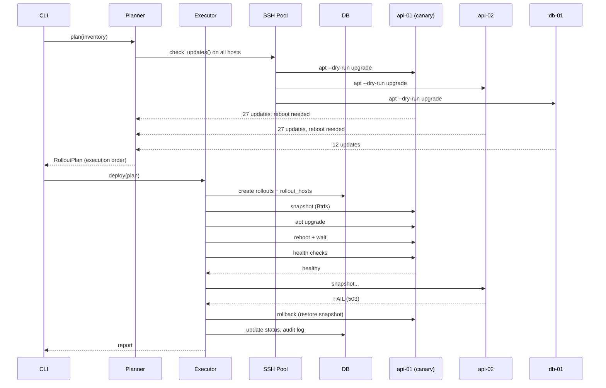

# PatchPilot

**Agentless Linux fleet update orchestration with canary deployments, health checks, and automatic rollback.**

PatchPilot is a single-purpose tool that solves one hard problem: how to safely update packages across dozens of Linux servers without accidentally taking down your entire environment.

---

## Why PatchPilot?

Existing configuration management tools (Ansible, Salt, Puppet) are **general-purpose**. They can update packages, but they don't specialise in the rollout problem:

- **No canary logic** — all hosts are updated in whatever order the playbook defines.
- **No automatic rollback** — if a package breaks a service, you find out from your monitoring, not from the tool.
- **No health verification** — "package installed" ≠ "service is actually working".
- **No state machine** — if the control machine crashes mid-rollout, you have no idea which hosts were updated.

PatchPilot is designed specifically for this workflow:

```
patchpilot plan production          → dry-run, see what would change
patchpilot deploy production        → canary → batch → health checks
patchpilot status rollout-2026-07-29 → see per-host state
patchpilot rollback rollout-2026-07-29 → restore from snapshot
```

---

## Features

- **Agentless** — communicates over SSH. No software to install on target hosts.
- **Canary deployments** — update one host first, verify it's healthy, then proceed.
- **Automatic rollback** — takes Btrfs/LVM/ZFS snapshots before each update, restores on failure.
- **Health checks** — verify systemd services, HTTP endpoints, TCP ports, journal logs, and custom commands after each update.
- **State machine** — each host progresses through defined states. Crashes are recoverable.
- **Idempotent** — snapshots are created once, updates are skipped if not needed, interrupted rollouts can be resumed.
- **Multi-distro** — Ubuntu/Debian (apt), Fedora/RHEL/Rocky (dnf), Arch Linux (pacman).
- **Maintenance windows** — restrict deployments to specific days/times with timezone support.
- **Audit trail** — every operation is logged with optional SHA256 hash chain for tamper detection.
- **Prometheus metrics** — expose rollout results via textfile collector.
- **SQLite/PostgreSQL** — state is stored in a database, not in memory.

---

## Quick start

### Prerequisites

- Python 3.11+
- SSH key with passwordless sudo access to target hosts
- Target hosts: Ubuntu, Debian, Rocky, Fedora, or Arch Linux

### Install

```bash
# From source (recommended)
git clone https://github.com/patchpilot/patchpilot.git
cd patchpilot
pip install -e .

# Or with uv (faster)
uv sync
```

### Configure

```bash
# Generate a stub config
patchpilot config init production

# Or write your own (see examples/)
vim ~/.config/patchpilot/production.yaml
```

### Run

```bash
# 1. See what would change
patchpilot plan production

# 2. Deploy with canary (1 host first, rest in batches of 2)
patchpilot deploy production --strategy canary

# 3. Check status
patchpilot status rollout-2026-07-29-abc123

# 4. If something went wrong — rollback
patchpilot rollback rollout-2026-07-29-abc123
```

---

## Example inventory

```yaml
metadata:
  name: production
  owner: sre@example.com

connection:
  ssh_user: deploy
  ssh_key_path: ~/.ssh/patchpilot_ed25519
  parallel_limit: 5

hosts:
  - name: api-01
    address: 10.10.0.11
    role: api
    tags: [canary-eligible]
  - name: api-02
    address: 10.10.0.12
    role: api
  - name: db-01
    address: 10.10.0.20
    role: database

strategy:
  type: canary
  canary:
    count: 1
    tag_filter: canary-eligible
  batch:
    size: 2

health_checks:
  global:
    - type: systemd
      service: ssh.service
  per_role:
    api:
      - type: http
        url: http://localhost:8080/health
        expected_status: 200
      - type: journal
        service: nginx.service
        forbidden_patterns: ["OutOfMemory"]
    database:
      - type: tcp
        host: localhost
        port: 5432
      - type: command
        command: pg_isready -q
        expected_exit_code: 0

snapshot:
  preferred: auto
  on_unavailable: warn

maintenance:
  timezone: Europe/Warsaw
  windows:
    - start: "23:00"
      end: "02:00"
      days: [saturday, sunday]
```

---

## How it works



---

## Project structure

```
patchpilot/
├── patchpilot/              # Main package
│   ├── cli/                 # Click commands (plan, deploy, status, rollback, …)
│   ├── inventory/           # YAML parsing, Pydantic validation
│   ├── ssh/                 # Async SSH pool, connection management
│   ├── rollout/             # Planner, Executor, State Machine, Strategies
│   ├── packages/            # Apt, Dnf, Pacman backends
│   ├── snapshots/           # Btrfs, LVM, ZFS providers
│   ├── health/              # systemd, http, tcp, journal, command checks
│   ├── audit/               # Event logging, hash chain
│   ├── metrics/             # Prometheus textfile output
│   ├── maintenance/         # Maintenance window validation
│   ├── locking/             # Database-level rollout locks
│   └── db/                  # SQLAlchemy models and session
├── tests/
│   ├── unit/                # Mock-based unit tests
│   ├── integration/         # Docker container tests
│   └── e2e/                 # End-to-end CLI tests
├── docker/                  # Dockerfiles for integration testing
├── examples/                # Sample inventory YAML files
├── pyproject.toml
└── README.md
```

---

## Roadmap

### MVP (v0.1)
- [x] Project structure, toolchain, models
- [ ] CLI skeleton with all commands
- [ ] SSH engine (async, pool, retry, sudo)
- [ ] Apt package manager
- [ ] Inventory parsing + validation
- [ ] Planner (dry-run, report)
- [ ] State machine + SQLite
- [ ] Executor + canary strategy
- [ ] Health checks (systemd, http)
- [ ] Basic recovery (resume interrupted rollout)
- [ ] Unit tests

### v0.2
- [ ] Dnf package manager
- [ ] Btrfs/LVM/ZFS snapshots
- [ ] Automatic rollback
- [ ] Maintenance windows
- [ ] Prometheus metrics
- [ ] Notification hooks (Slack, Discord)
- [ ] Batch strategy
- [ ] Integration tests (Docker)

### v0.3
- [ ] RBAC / approval workflow
- [ ] Audit hash chain
- [ ] PostgreSQL support
- [ ] Web dashboard (optional)
- [ ] systemd-sysupdate (A/B image updates)

---

## Licence

MIT
